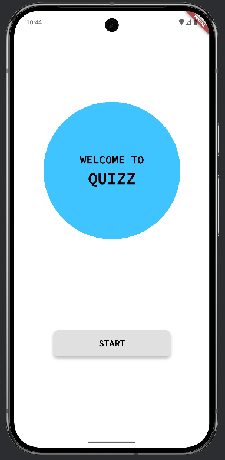
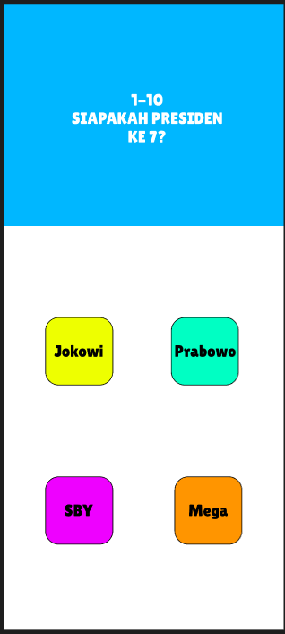
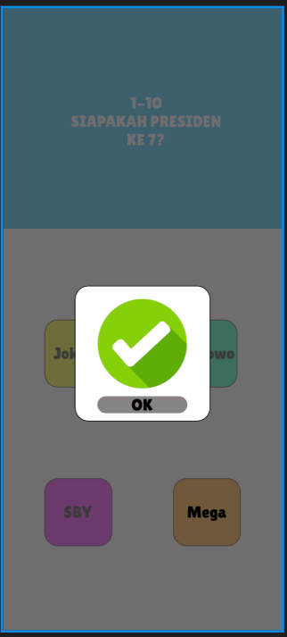
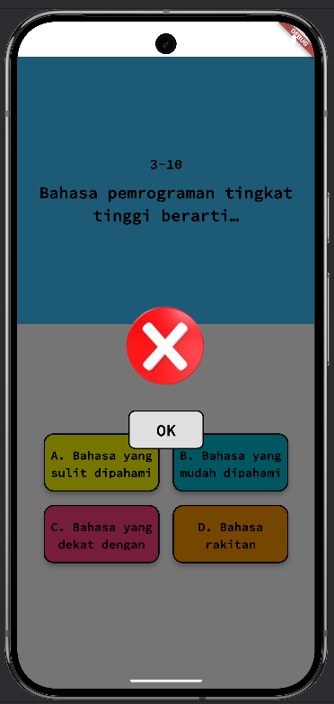
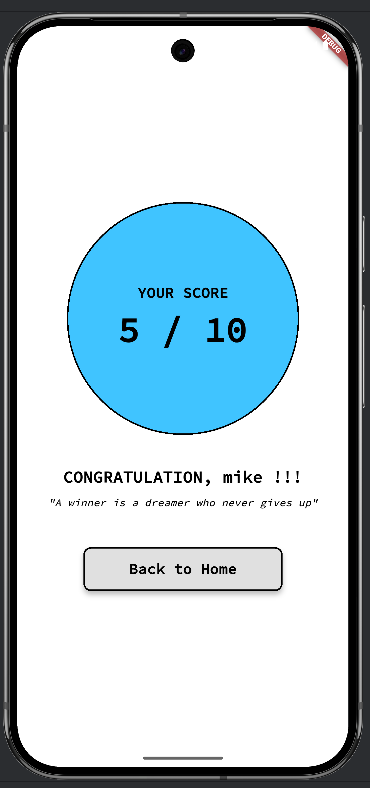

# Quizz App

## Identitas Mahasiswa
- **Nama** : Michael Valent Satrio Munthe
- **NIM** : 231401103
- **Lab** : 2

---

## Deskripsi Aplikasi
**Quizz App** adalah aplikasi kuis pilihan ganda yang dibuat menggunakan Flutter sebagai pemenuhan tugas Ujian Tengah Semester (UTS) mata kuliah Lab Pemrograman Mobile 2.

Aplikasi ini memiliki alur di mana pengguna memasukkan nama, kemudian menjawab 10 pertanyaan seputar pengetahuan dasar teknologi/komputer. Setiap jawaban akan divalidasi dan pengguna akan mendapatkan *feedback* visual (benar atau salah) secara langsung. Di akhir kuis, aplikasi akan menampilkan total skor yang diperoleh oleh pengguna.

---

## Fitur Utama & Kriteria yang Diterapkan
Aplikasi ini dibuat dengan memenuhi kriteria wajib dari soal UTS:
- **State Management:** Progres (skor dan indeks pertanyaan) dikelola dan tidak hilang saat navigasi atau rotasi (di-handle oleh `StatefulWidget` dan `Navigator` dengan *arguments*).
- **Navigasi:** Menerapkan navigasi antar halaman (Welcome -> Input Nama -> Kuis -> Skor).
- **Widget Reusable:** Komponen tombol jawaban (`answer_button.dart`) dibuat sebagai *widget* terpisah untuk digunakan kembali.
- **UI Dinamis & Responsif:** Ukuran elemen UI (tombol, kontainer) menggunakan persentase dari `MediaQuery` (Kriteria #6), bukan nilai *hardcode*.
- **Aset & Font Kustom:** Menggunakan aset gambar kustom (`logo_benar.png`, `logo_salah.png`) untuk *feedback*.
- **Data Lokal:** 10 soal dan jawaban disimpan secara lokal (dummy data) di dalam aplikasi.
- **Struktur Proyek:** Menggunakan struktur folder yang rapi (screens, widgets, models).

---

## Link Mockup/Prototype
- **Link Desain Figma:** [https://www.figma.com/design/Id9D9CIDC3DVbWn0P2ubwL/Untitled?node-id=0-1&t=WqCbHTztjiwubjlJ-1]

---

## Kredit Aset
- **Ikon Benar (Ceklis):** [canva.com]
- **Ikon Salah (Silang):** [canva.com]
- **Font Kustom:** [Font 'SourceCodePro-Medium' dari Google Fonts]

---
## Screenshot Aplikasi

| Halaman Welcome | Halaman Kuis |
| :---: | :---: |
|  |  |
| Feedback Benar | Feedback Salah |
| :---: | :---: |
|  |  |
| Halaman Skor |
| :---: |
|  |
